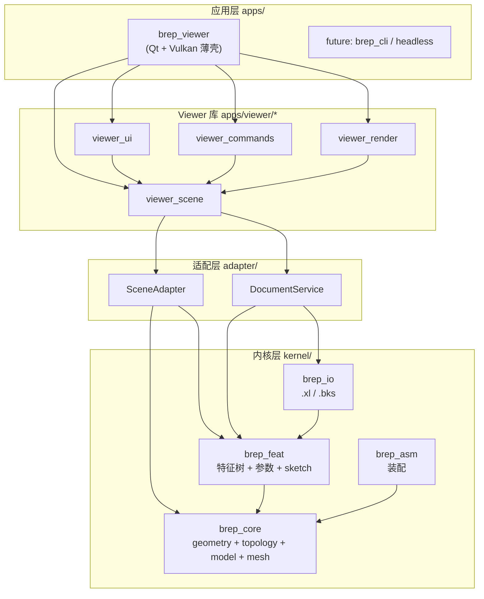

# B-Rep Kernel / XCAD Viewer 工程化重构方案

**状态**：待评审  
**日期**：2026-08-08  
**范围**：`include/`、`src/`、`apps/viewer/`、根 `CMakeLists.txt`  
**目标**：在保持功能可用的前提下，将当前「单库 + 大文件 + 宽依赖」结构，重构为**分层、模块化、可增量编译、可测试**的工程布局。

---

## 1. 背景与现状

### 1.1 当前结构

```
brepkernelstudy/
├── CMakeLists.txt          # 构建 lib brep + examples + 可选 brep_viewer
├── include/brep/           # 内核公开头文件（37 个）
├── src/                    # 内核实现（27 个 .cpp）
├── apps/viewer/            # Qt6 + Vulkan Viewer（49 个 .cpp/.hpp）
├── examples/               # 内核回归示例（box_demo, smoke, …）
└── third_party/            # eigen, spdlog, volk, entt, boost_uuid, …
```

依赖关系（当前）：

```
Qt6 / Vulkan / EnTT
        ↓
   brep_viewer (单 executable，~30 个源文件直接编进 exe)
        ↓  PRIVATE link，直接 #include "brep/brep.hpp"
      brep (单 static lib，所有内核模块一次编译)
        ↓
   Eigen / Boost.Uuid / spdlog
```

### 1.2 已具备的优点

| 项 | 说明 |
|----|------|
| 内核与 Viewer 已 CMake 分离 | `brep` 静态库 + `brep_viewer` 可执行文件 |
| Viewer 子目录有雏形 | `commands/`、`ecs/`、`i18n/` 职责相对清晰 |
| 内核概念分层存在 | geometry → topology → model → feat → document |
| 命令模式已引入 | `CommandManager` / `ITool` 便于扩展交互工具 |
| 内核有 examples 回归 | `box_demo`、`smoke`、`xl_roundtrip` 等 |

### 1.3 主要问题

| 问题 | 具体表现 | 影响 |
|------|----------|------|
| **内核单库** | 根 `CMakeLists.txt` 一个 `add_library(brep …)` 包含 geometry/feat/io 全部 | 改 IO 也要重编 geometry；无法按需链接 |
| **无稳定 API 边界** | Viewer 多处 `#include "brep/brep.hpp"`（umbrella 头） | 内核任意头文件变更可能触发 Viewer 全量重编 |
| **UI 与领域逻辑混合** | `main_window.cpp` ~1300 行 | 难维护、难单测、多人协作冲突多 |
| **渲染单体文件** | `vulkan_renderer.cpp` ~1200 行 | Vulkan 生命周期、管线、上传、绘制全在一个 TU |
| **特性 UI 无抽象** | `property_panel` 直接 `static_cast<const BoxFeature*>` | 每增加一种特征类型都要改 UI 层 |
| **ECS 桥接承担过多** | `World::sync_part_bodies()` 直接调用 tessellation、读 FeatureTree | Viewer 的 ECS 层了解内核再生语义 |
| **Viewer 无自动化测试** | 仅内核 examples 有 CTest | UI/命令/渲染回归靠手动 |
| **umbrella 头鼓励宽依赖** | `brep/brep.hpp` 一次引入全部模块 | 新代码倾向于 include-everything |

### 1.4 关键文件规模（参考基线）

| 文件 | 约行数 | 职责 |
|------|--------|------|
| `apps/viewer/main_window.cpp` | 1300+ | 菜单、MDI、输入、命令、属性面板、上下文菜单 |
| `apps/viewer/vulkan_renderer.cpp` | 1200+ | Vulkan 全生命周期 |
| `apps/viewer/ecs/systems.cpp` | 520+ | 渲染缓存、选中高亮 |
| `apps/viewer/commands/builtin_commands.cpp` | 390+ | 文件/导出等内置命令 |
| `apps/viewer/commands/tools/create_box_tool.cpp` | 390+ | 创建立方体交互 |
| `apps/viewer/command_manager.cpp` | 90+ | 命令调度（已较清晰） |

---

## 2. 目标与非目标

### 2.1 目标

| 项目 | 要求 |
|------|------|
| **模块化构建** | 内核与 Viewer 拆为多个 CMake target，增量编译 |
| **依赖单向** | 上层依赖下层；内核不依赖 Qt/Vulkan |
| **窄接口** | Viewer 通过 Adapter 访问文档/特征/网格，不直接依赖具体 Feature 类 |
| **大文件拆分** | `main_window.cpp`、`vulkan_renderer.cpp` 按职责拆分到 <400 行/TU 为主 |
| **可测试** | 内核 + Adapter + 命令逻辑可单元测试；examples 保留 |
| **渐进迁移** | 每阶段可独立合并，不中断功能开发 |

### 2.2 非目标（本方案不做）

- 拆成多个 Git 仓库或微服务
- 一次性重写 Viewer 或内核
- 抽象跨图形 API 的渲染引擎（Vulkan → 通用 RHI）
- 将 Qt 依赖下沉到内核
- 引入插件系统 / 脚本引擎（可作为后续 v2）

---

## 3. 目标架构

### 3.1 分层总览



### 3.2 内核内部分层（逻辑依赖）

```
types / math
    ↓
geometry → topology → model
    ↓
builder / ops / mesh
    ↓
param → sketch → solve2d → feat (FeatureTree + Regenerator)
    ↓
document / part / object_registry / asm
    ↓
io (xl_document, bks_cache)
```

### 3.3 依赖规则（必须遵守）

1. **apps/** 只依赖 **adapter/** 和 **viewer 库**，不直接 `#include` 内核 `internal/` 头。
2. **adapter/** 只依赖内核 **公开 API**（`include/brep/api/`），不依赖 Viewer。
3. **kernel/** 各子库：`brep_feat` → `brep_core`；`brep_io` → `brep_feat`；禁止反向。
4. 内核**不得**链接 Qt、Vulkan、EnTT。

---

## 4. 目标目录结构

Phase 1–3 完成后推荐布局（路径迁移可渐进，不必一步到位）：

```
brepkernelstudy/
├── cmake/
│   ├── BrepCore.cmake
│   ├── BrepFeat.cmake
│   ├── BrepIO.cmake
│   ├── BrepAsm.cmake
│   └── BrepAll.cmake           # INTERFACE 聚合，兼容旧 target 名 brep
├── docs/
│   ├── architecture/           # 本文档 + ADR
│   └── viewer/
├── kernel/
│   ├── include/brep/
│   │   ├── api/                # 分级公开头（Phase 4）
│   │   │   ├── core.hpp
│   │   │   ├── modeling.hpp
│   │   │   ├── persistence.hpp
│   │   │   └── mesh.hpp
│   │   └── …                   # 现有模块头文件（逐步归类）
│   └── src/
│       ├── geometry.cpp, topology.cpp, …
│       ├── feat/, io/, asm/, …
├── adapter/
│   ├── include/brep/adapter/
│   │   ├── scene_adapter.hpp
│   │   └── document_service.hpp
│   └── src/
│       ├── scene_adapter.cpp
│       └── document_service.cpp
├── apps/
│   └── viewer/
│       ├── CMakeLists.txt
│       ├── main.cpp            # 薄入口
│       ├── app/                # 应用壳（main_window 瘦身）
│       ├── ui/                 # home, splash, property_panel, view_cube, …
│       ├── render/             # vulkan_*, camera, shaders
│       ├── scene/              # ecs/world, systems, components
│       ├── commands/           # 保持现有结构
│       ├── io/                 # dxf_export
│       └── i18n/
├── examples/                   # 内核回归，保持不变
├── tests/                      # 新增
│   ├── kernel/
│   └── adapter/
└── third_party/
```

---

## 5. 分阶段实施计划

### Phase 0 — 准备（0.5 天）

- [ ] 评审并确认本文档
- [ ] 建立 `docs/architecture/adr/` 目录，重大决策写 ADR
- [ ] 记录当前编译耗时基线（全量 / 改 main_window / 改 geometry）
- [ ] 确认 CI 或本地脚本：`ctest` + viewer 手动冒烟清单

**产出**：团队对阶段边界与「不做什么」达成一致。

---

### Phase 1 — CMake 内核模块化（1–2 天）

**原则**：只改 CMake，**不改任何 .cpp 行为**。

#### 1.1 拆分 target

| Target | 源文件 | 依赖 |
|--------|--------|------|
| `brep_core` | geometry, topology, model, builder, mesh, validate, dump, log, guid, math | Eigen |
| `brep_feat` | feat/, param/, sketch/, solve2d/, ops/ | brep_core |
| `brep_io` | io/ | brep_feat |
| `brep_asm` | asm/ | brep_core |
| `brep` (INTERFACE) | — | 聚合上述全部，兼容现有 `target_link_libraries(… brep)` |

#### 1.2 示例 CMake 片段

```cmake
# cmake/BrepCore.cmake
add_library(brep_core STATIC
  src/geometry.cpp
  src/topology.cpp
  src/model.cpp
  # …
)
target_include_directories(brep_core PUBLIC ${CMAKE_SOURCE_DIR}/include)
target_link_libraries(brep_core PUBLIC Eigen3::Eigen brep_boost_uuid)

add_library(brep_feat STATIC src/feat/feature_tree.cpp …)
target_link_libraries(brep_feat PUBLIC brep_core)

add_library(brep INTERFACE)
target_link_libraries(brep INTERFACE brep_core brep_feat brep_io brep_asm)
```

#### 1.3 验收

- [ ] 现有 examples 全部通过 `ctest`
- [ ] `brep_viewer` 正常编译运行
- [ ] 修改 `src/io/xl_document.cpp` 时，`geometry.cpp` 所在 TU **不**重编（Ninja 验证）

---

### Phase 2 — Viewer 内部拆分（3–5 天）

**原则**：行为不变，物理移动 + 大文件拆分。

#### 2.1 CMake 多库

| Target | 内容 |
|--------|------|
| `viewer_render` | `vulkan_renderer`, `vulkan_window`, `camera`, shader 资源 |
| `viewer_scene` | `ecs/world`, `ecs/systems`, `ecs/components` |
| `viewer_commands` | `commands/*` |
| `viewer_ui` | `main_window`, `home_window`, `property_panel`, `view_cube`, … |
| `brep_viewer` | 仅 `main.cpp` + link 上述库 |

#### 2.2 `main_window.cpp` 拆分

| 新文件 | 职责 |
|--------|------|
| `ui/main_window_menus.cpp` | 菜单/工具栏创建、`retranslate_ui` |
| `ui/view_manager.cpp` | MDI 子窗口创建、四视图、平铺/层叠 |
| `ui/input_router.cpp` | `eventFilter`、滚轮缩放、工具鼠标路由 |
| `ui/cursor_tip.cpp` | 光标跟随提示 |
| `ui/context_menu.cpp` | 视口右键菜单 |
| `app/main_window.cpp` | 构造/析构、生命周期、对外 slots（目标 <400 行） |

#### 2.3 `vulkan_renderer.cpp` 拆分

| 新文件 | 职责 |
|--------|------|
| `render/vulkan_context.cpp` | Instance, device, swapchain, surface |
| `render/vulkan_pipeline.cpp` | Shader module, pipeline layout, render pass |
| `render/vulkan_buffer.cpp` | Vertex/index/uniform buffer 分配与更新 |
| `render/vulkan_draw.cpp` | 每帧录制、draw call |
| `render/mesh_uploader.cpp` | `TriangleMesh` / `EdgeMesh` → GPU |

#### 2.4 验收

- [ ] Viewer 功能冒烟：新建/打开/保存/创盒/复制/撤销/语言切换/关闭保存提示
- [ ] 无新增编译警告
- [ ] 单文件行数：新增 TU 原则上 <500 行，`main_window` 核心 <400 行

---

### Phase 3 — Adapter 适配层（5–7 天）

**原则**：Viewer 与命令逐步改为只依赖 Adapter，消除 `#include "brep/brep.hpp"`。

#### 3.1 核心类型（草案）

```cpp
// adapter/include/brep/adapter/scene_adapter.hpp
namespace brep::adapter {

struct BoxParams { double length, width, height; };

struct SceneObject {
  Guid body_guid;
  std::string name;
  std::string type_name;              // "Box", "Extrude", …
  std::optional<BoxParams> box;       // 按类型填充，避免 BoxFeature*
};

struct MeshBundle {
  TriangleMesh faces;
  EdgeMesh edges;
};

class SceneAdapter {
 public:
  explicit SceneAdapter(brep::Document& doc);

  std::vector<SceneObject> list_objects() const;
  std::optional<SceneObject> get_object(Guid id) const;
  void set_box_params(Guid body_id, const BoxParams& p);
  std::vector<Guid> copy_objects(std::span<const Guid> ids, Vec3d offset);

  MeshBundle tessellate(Guid body_id) const;

  using ChangeCallback = std::function<void()>;
  void on_document_changed(ChangeCallback cb);
};

}  // namespace brep::adapter
```

```cpp
// adapter/include/brep/adapter/document_service.hpp
namespace brep::adapter {

class DocumentService {
 public:
  [[nodiscard]] bool load(const std::filesystem::path& path, brep::Document& out);
  [[nodiscard]] bool save(const brep::Document& doc, const std::filesystem::path& path);
  [[nodiscard]] bool export_dxf(/* … */);  // 可选：从 viewer/io 迁入
};

}  // namespace brep::adapter
```

#### 3.2 迁移映射

| 现有直接使用 | 迁移后 |
|--------------|--------|
| `property_panel` → `BoxFeature*` | `SceneObject::box` |
| `World::sync_part_bodies()` → `tessellate_body` | `SceneAdapter::tessellate` |
| `copy_tool` → `Part` / `add_box` | `SceneAdapter::copy_objects` |
| `builtin_commands` → `io::save_xl` | `DocumentService::save` |
| `main_window` → `part->feature_history()` | 通过 Adapter 或 Command 层封装 |

#### 3.3 迁移顺序（降低风险）

1. 新增 `adapter/` 库 + 单元测试（与现有行为对照 examples）
2. `ecs/world.cpp` 改用 `SceneAdapter::tessellate`
3. `property_panel` 改用 `SceneObject`
4. `builtin_commands` 改用 `DocumentService`
5. 工具类（`copy_tool`, `create_box_tool`）改用 Adapter
6. 删除 Viewer 中 `#include "brep/brep.hpp"`（最后一步）

#### 3.4 验收

- [ ] Viewer 源码中 **0** 处 `#include "brep/brep.hpp"`
- [ ] `property_panel` 无 `static_cast<const BoxFeature*>`
- [ ] Adapter 层有 Catch2 测试覆盖：`list_objects`, `tessellate`, `copy_objects`
- [ ] 功能冒烟与 Phase 2 相同

---

### Phase 4 — 内核 API 分级（长期，可选）

#### 4.1 公开头分级

| 头文件 | 内容 | 稳定级别 |
|--------|------|----------|
| `api/core.hpp` | geometry, topology, model, types | 高 |
| `api/mesh.hpp` | tessellation | 中 |
| `api/modeling.hpp` | builder, feat, param | 中 |
| `api/persistence.hpp` | io | 低（随格式演进） |

#### 4.2 约束

- `brep/brep.hpp` 保留但标记 `[[deprecated]]`，引导改用分级头
- Viewer / Adapter 只允许 include `api/*`
- `internal/` 目录不进入 PUBLIC include path

#### 4.3 验收

- [ ] CMake `target_compile_definitions` 或 include 检查脚本验证依赖边界
- [ ] 文档列出每个公开类型的所有者模块

---

## 6. 测试策略

| 层级 | 测什么 | 工具 | 阶段 |
|------|--------|------|------|
| 内核 | 几何、拓扑、特征再生、IO roundtrip | 现有 examples + Catch2 | Phase 1 起 |
| Adapter | SceneAdapter / DocumentService | Catch2 + 临时 Document fixture | Phase 3 |
| 命令 | CopyTool / CreateBoxTool 纯逻辑 | 提取函数 + Catch2 | Phase 2–3 |
| Viewer UI | 菜单、对话框 | 手动冒烟清单 | 持续 |
| 渲染 | 管线正确性 | 手动 + 未来 screenshot diff | 非 v1 |

### 6.1 建议新增目录

```
tests/
├── kernel/
│   ├── test_box_feature.cpp
│   └── test_xl_roundtrip.cpp
└── adapter/
    ├── test_scene_adapter.cpp
    └── test_document_service.cpp
```

根 `CMakeLists.txt`：

```cmake
option(BREP_BUILD_TESTS "Build unit tests" ON)
if(BREP_BUILD_TESTS)
  enable_testing()
  add_subdirectory(tests)
endif()
```

---

## 7. 优先级与排期建议

资源有限时推荐顺序：

| 优先级 | 阶段 | 预估 | 理由 |
|--------|------|------|------|
| P0 | Phase 0 准备 | 0.5 天 | 对齐共识 |
| P1 | Phase 2 前半（拆 main_window / vulkan_renderer） | 2–3 天 | 立刻降低维护成本 |
| P2 | Phase 1（CMake 内核多 target） | 1–2 天 | 缩短编译反馈 |
| P3 | Phase 3（Adapter） | 5–7 天 | 解耦，为 Extrude 等 UI 扩展铺路 |
| P4 | Phase 2 后半（Viewer 多库 CMake） | 1–2 天 | 与 P1 可合并 |
| P5 | Phase 4（API 分级） | 持续 | 长期质量 |

**合计**：约 **10–15 人日**（含测试与冒烟），可分多个 PR 交付。

---

## 8. 风险与缓解

| 风险 | 缓解 |
|------|------|
| 大搬家 PR 难以 review | 每 PR 只做一件事：纯 CMake / 纯移动 / 纯 Adapter 一个调用点 |
| 行为回归 | 每阶段固定冒烟清单；examples + 新 Catch2 测试 |
| Adapter 过度设计 | 先覆盖当前 Viewer 实际用到的 API，不预先抽象未出现的特征 |
| 路径变更破坏 IDE/CLion | 保留 `brep` INTERFACE target 名；include 路径保持 `include/brep/` |
| 拆分后链接错误 | Phase 1/2 每步全量编译 + ctest |
| 与功能开发冲突 | 重构 PR 与 feature PR 交替；Adapter 与新特征（如 Extrude UI）可并行 |

---

## 9. 不做清单（明确边界）

- ❌ 多 Git 仓库
- ❌ 内核引入 Qt/Vulkan
- ❌ 一次性重写 `vulkan_renderer`
- ❌ 未使用的通用插件框架
- ❌ 在 Phase 3 完成前大规模改特征类继承体系

---

## 10. 验收标准（整体完成）

- [ ] 内核至少 4 个独立 static/INTERFACE target（core/feat/io/asm）
- [ ] Viewer 至少 4 个 static lib + 薄 exe
- [ ] `main_window.cpp` < 400 行；`vulkan_renderer.cpp` 已拆且无单 TU > 600 行
- [ ] Viewer 无 `#include "brep/brep.hpp"`；无 Feature 具体类 `static_cast`
- [ ] `tests/` 下 Adapter + 内核关键路径有自动化测试
- [ ] `ctest` 全绿；Viewer 冒烟清单全通过
- [ ] 文档：`docs/architecture/` 含本文档 + 至少 1 份 ADR（Adapter 引入决策）

---

## 11. 附录

### A. 冒烟测试清单（每阶段执行）

1. 启动 → Home → 新建文档 → 进入 MainWindow  
2. 三点创建立方体；快速创建立方体  
3. 选中 → 复制（预选手势 + 后选手势）  
4. 属性面板修改 L/W/H → 模型再生  
5. 撤销 / 重做  
6. 保存 → 关闭 → 重新打开  
7. 四视图 / 平铺 / 层叠  
8. Tools → Language 中英切换（菜单、属性、视图标题）  
9. 未保存关闭 → 保存/不保存/取消  
10. 导出 DXF（若可用）

### B. 相关文档

- [Viewer 中英双语设计](../viewer/i18n-zh-en-bilingual-design.md)
- ADR 目录（待建）：`docs/architecture/adr/`

### C. 修订记录

| 日期 | 版本 | 说明 |
|------|------|------|
| 2026-08-08 | v0.1 | 初稿 |

---

## 12. 待确认事项

请评审后确认：

1. **Phase 1 与 Phase 2 的先后顺序** — 本文建议先做 Phase 2 大文件拆分（P1），再做 Phase 1 CMake（P2）；是否同意？  
2. **Adapter 是否放在 `adapter/` 顶层** — 还是 `apps/viewer/adapter/`（仅 Viewer 使用）？  
3. **测试框架** — Catch2（header-only） vs GoogleTest？  
4. **目录迁移** — 是否接受 `include/` → `kernel/include/` 物理搬迁，还是 Phase 1 仅 CMake 逻辑拆分、路径暂不动？  

确认后按 Phase 0 → 1/2 → 3 → 4 逐步落地。
